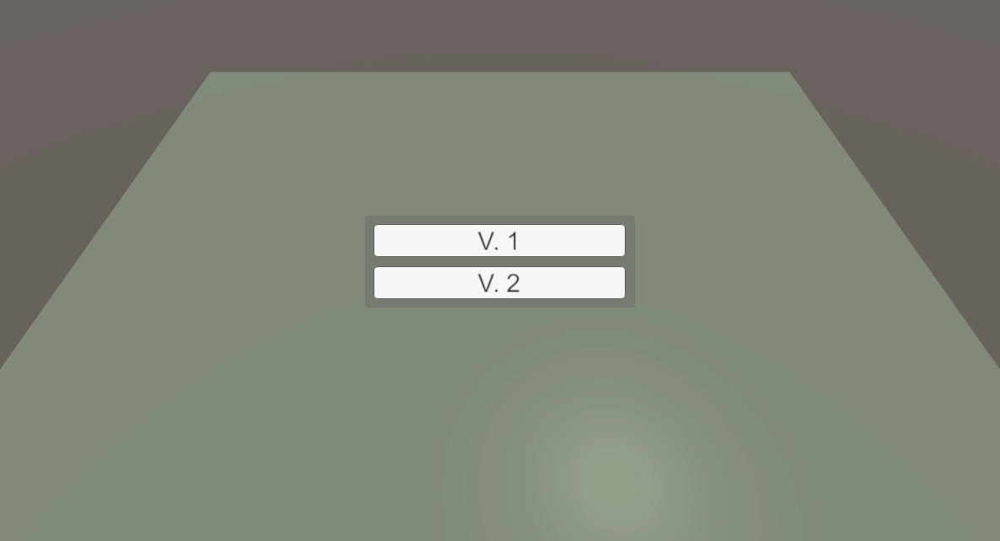

# Реализация схематического тренажера по замене предохранителя в условном электрическом устройстве. #

Реализовано два сценария прохождения (V1 и V2). Выбор предоставляется на старте.

### Основные сущности:

#### Controller & Init
Root - точка входа (в сцене).
SessionController - основная управляющая сущность.
UIManager - менеджер экранов.

#### Model
Session - ключевая сущность, аггрегирующая в себе и информацию о прохождение сценария (кол-во ошибок, время). 
Scenario - сценарий реализован в виде ScriptableObject для удобства редактирования шагов.
Selector - Базовый переключатель потомки которого используются для прохождения шаго сценария. 
Step - Шаг сценария, содержащий условие и "правильный ответ". 

#### View
SessionScenarioView - визуально представление сценария. Собрано в единый префаб для удобства загрузки (V1.prefab или V2.prefab соотвественно).
Содержит в себе множество реализаций базового Selector'а.

